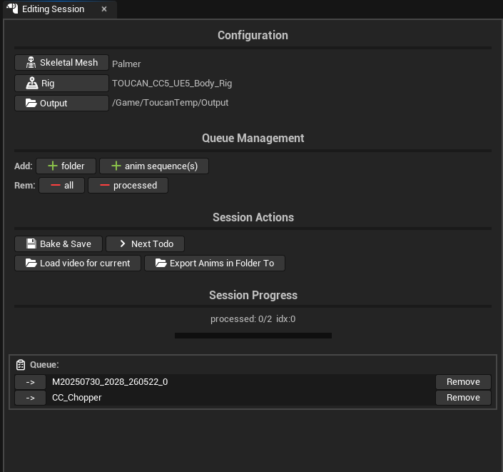

# Toucan Session Sequencer

## Why Use This Plugin

Toucan Session Sequencer is for editor sessions where many animation clips need to be reviewed, adjusted, baked, and marked as done. It keeps the session state in one place: the avatar, rig, queued animations, current sequence, related video reference, and processed output.

The goal is to avoid rebuilding the same Sequencer setup for every clip and to make it easier to keep track of which animations still need work.

## Plugin Functionalities

- Queue animation assets for post-processing.
- Load the next queued animation into a reusable editing sequence.
- Spawn or reuse the configured skeletal mesh actor.
- Add the selected Control Rig to the sequence.
- Snap animation sections to their source timecode when available.
- Keep the Sequencer view focused on the animation section.
- Load a reference video for the current animation.
- Bind reference video playback to a MediaPlate so the Sequencer playhead controls it.
- Align video sections by Unreal source timecode, with `ffprobe` fallback.
- Generate cached 1080 video proxies for heavy source videos to improve editor playback.
- Bake the edited sequence back to an animation asset.
- Save lightweight metadata for baked animation output.
- Track processed queue items.
- Optional MIDI-driven Sequencer and rig controls when the MIDI mapper plugin is present.

## Requirements

- Unreal Engine 5.7 project with this plugin enabled.
- A configured skeletal mesh/avatar for the editing session.
- A compatible Control Rig if rig editing is needed.
- Media plugins required by the module, including MediaAssets, MediaCompositing, and MediaPlate.
- `ffprobe` on PATH for video timecode fallback and video resolution probing.
- `ffmpeg` on PATH for automatic 1080 review proxy generation.
- Optional: `UnrealMidi` / `MidiMapper` for MIDI controls.
- `SequencerAbstraction` for shared Sequencer helper functionality.
